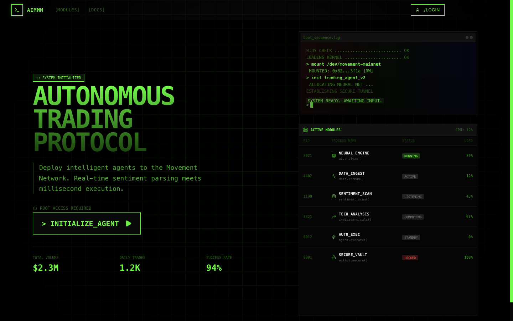

<div align="center">

# AIMMM

**Seven agents decide the trade. The user pays for the run over HTTP 402.**

[](https://ai-mmm.vercel.app)
[](https://x402.org)
[](https://langchain-ai.github.io/langgraph/)
[](https://fastapi.tiangolo.com)
[](https://nextjs.org)
[](LICENSE)

<a href="https://ai-mmm.vercel.app">
  
</a>

<sub><a href="https://ai-mmm.vercel.app">Open the live app</a></sub>

</div>

---

## What this is

An autonomous trading system where the reasoning is done by a graph of agents and the
service is metered by the payment protocol rather than by an account system.

Two things make it worth reading. The first is that the agents are wired as an explicit
state machine, not a prompt chain, so you can see exactly which node made which call and
where the flow branched. The second is that access is gated by **x402** — the client is
handed an HTTP 402, presents a signed payment header, and the server verifies it with a
facilitator before doing any work. No API keys, no subscriptions, no accounts.

## The agent graph

Built on a LangGraph `StateGraph` over a shared `TradingState`. Seven nodes:

```
MARKET_DATA ──▶ PORTFOLIO ──▶ MONITORING ──▶ RISK
                                              │
                                     ANALYSIS ─┴──▶ DECISION ──▶ RISK ──▶ EXECUTION ──▶ END
```

| Node | Responsibility |
|---|---|
| `market_data_agent` | Pulls prices and market state from oracles |
| `portfolio_agent` | Reads current holdings and exposure |
| `monitoring_agent` | Watches open positions and running conditions |
| `risk_agent` | Applies limits. Sits between the decision and the execution, deliberately |
| `analysis_agent` | Interprets the market picture |
| `decision_agent` | Chooses the action |
| `execution_agent` | Places it, then the graph terminates |

Routing between several of these is conditional, so a run can end early rather than
forcing every step. `metrics.py` records what each node did.

## How the payment works

`backend/app/services/x402.py` implements the resource-server half of x402:

1. The client sends an `X-PAYMENT` header, base64-encoded JSON.
2. The server decodes it, pulls out the invoice ID, and posts the payment plus the
   declared requirements to the configured facilitator's `/verify` endpoint.
3. The facilitator answers. On success the server gets back a transaction hash, ties it to
   the invoice, and only then runs the graph.

The effect is that a single agent run is a priced unit of work, settled on-chain, with no
relationship between the caller and the service beyond the payment itself. That is the
property x402 exists to provide, and it fits an agent that is expensive to run and has no
reason to know who you are.

## Stack

| | |
|---|---|
| Agents | LangGraph `StateGraph`, seven nodes over a shared state object |
| Inference | OpenRouter |
| Payments | x402, verified against a facilitator |
| Market data | Switchboard oracles |
| Execution venue | Mosaic DEX aggregator |
| Network | Movement |
| Backend | FastAPI, Python 3.11 |
| Frontend | Next.js, TypeScript, pnpm workspace |
| Storage | Supabase |
| Deploy | Vercel (frontend), Railway / Render / Fly (backend), Docker |

## Running it

```bash
pnpm install

cd backend
cp .env.example .env          # facilitator URL, OpenRouter key, Supabase creds
pip install -r requirements.txt

cd ../frontend
cp .env.local.example .env.local

pnpm dev                      # both services
pnpm dev:backend              # :8000
pnpm dev:frontend             # :3000
```

## Layout

```
backend/
  app/
    agents/      the seven nodes, the graph, shared state, metrics
    services/    x402 verification, oracle reads, Mosaic routing
    routers/     HTTP surface, including the payment-gated endpoints
    models/      payment and execution records
frontend/
  app/hooks/     use-x402-payment.ts — the client half of the 402 flow
```

## Status

Built for a hackathon and deployed. The agent graph, the x402 verification path and the
execution route all work end to end against live services. It has not been audited, and
nothing here is financial advice or a recommendation to trade.

MIT licensed.
